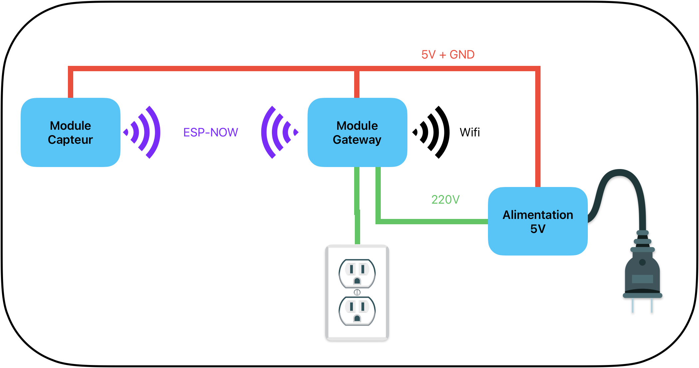
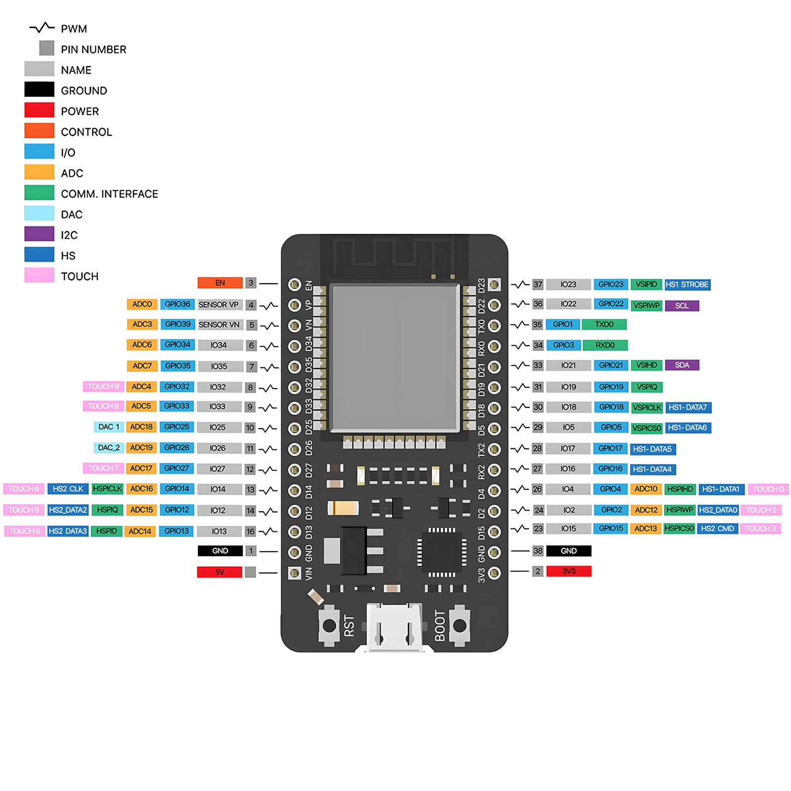
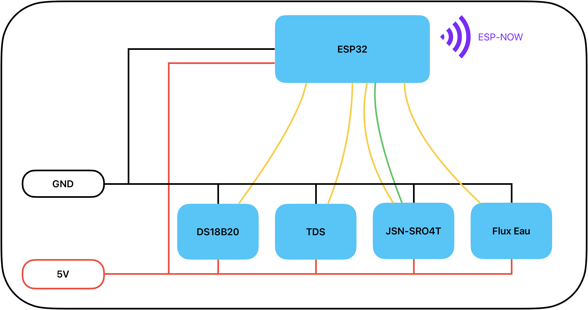
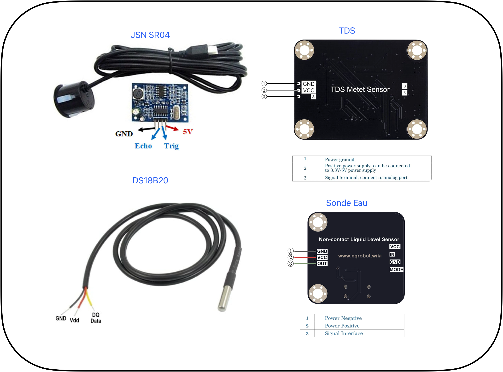
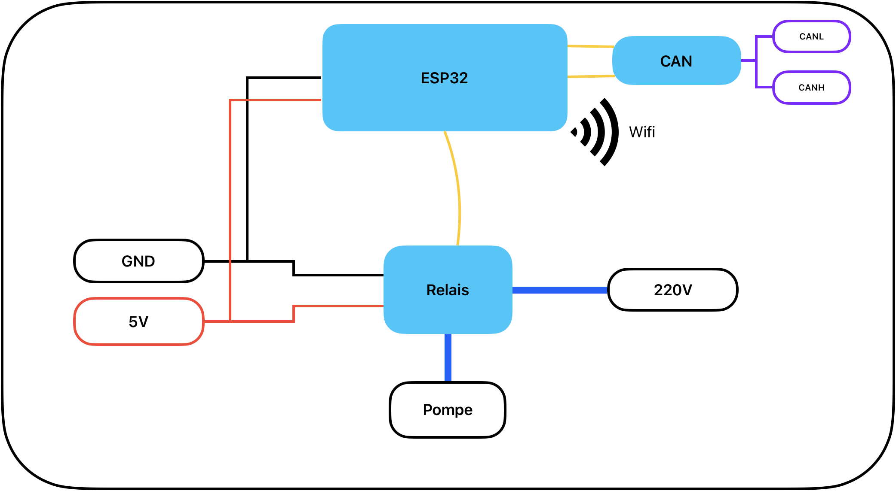

# HydroponX
Ce projet décrit un ensemble de module pilotés par des microcontroleur ESP32 permettant de controler automatiquement un système de culture hydroponique.
Tous les modules communiquent entre eux par un bus CAN.

Module Capteur:
- mesure la temperature de l'eau par un capteur DS18B20
- mesure l'EC de l'eau par un capteur TDS de CQRobot
- mesure le niveau d'eau restant dans le réservoir par un capteur JNS-SR04T
- mesure la présence d'eau revenant dans le réservoir par un capteur de présence d'eau de CQRobot
- envoie toutes les minutes ces mesures au module Gateway via le bus CAN

Module Gateway:
- pilote la pompe à eau du système par un module relais
- collecte les mesures du module capteur via le bus CAN, et les envoient sur un broker MQTT par une connection Wifi

## Architecture


---

## ESP32 Pinout


---

## Module Capteur
### Architecture


### Cablage
| Capteur             | Broche ESP32 | Remarques                          |
|---------------------|--------------|------------------------------------|
| DS18B20 Data        | GPIO 4       | Résistance pull-up 4.7 kΩ vers 5V. |
| DS18B20 VCC         | 5V           |                                    |
| DS18B20 GND         | GND          |                                    |
| Sonde TDS (signal)  | GPIO 34      |                                    |
| Sonde TDS VCC       | 5V           |                                    |
| Sonde TDS GND       | GND          |                                    |
| JNS-SR04T Trig      | GPIO 5       |                                    |
| JNS-SR04T Echo      | GPIO 18      | Diviseur 5V→3.3V                   |
| JNS-SR04T VCC       | 5V           |                                    |
| JNS-SR04T GND       | GND          |                                    |
| Niveau eau (signal) | GPIO 35      |                                    |
| Niveau eau VCC      | 5V           |                                    |
| Niveau eau GND      | GND          |                                    |
| Module CAN GND      | GND          |                                    |
| Module CAN VCC      | 3.3V         |                                    |
| Module CAN xx       | GPIO xx      |                                    |
| Module CAN xx       | GPIO xx      |                                    |



---

## Module Gateway MQTT
### Architecture



### Cablage
| Composant         | Broche ESP32 | Remarques                          |
|-------------------|--------------|------------------------------------|
| Relais pompe1     | GPIO 32      | LOW = pompe ON                     |
| Relais pompe2     | GPIO 33      | LOW = pompe ON                     |
| Relais VCC        | 3.3V         |                                    |
| Relais GND        | GND          |                                    |
| Module CAN GND    | GND          |                                    |
| Module CAN VCC    | 3.3V         |                                    |
| Module CAN xx     | GPIO xx      |                                    |
| Module CAN xx     | GPIO xx      |                                    |

### Topics MQTT publiés par Module Gateway
| Topic                 | Valeur exemple | Description              |
|-----------------------|----------------|--------------------------|
| `hydro1/waterTemp  `  | `22.50`        | Température eau (°C)     |
| `hydro1/waterEc`      | `1.850`        | Conductivité (mS/cm)     |
| `hydro1/waterLevel `  | `75`           | Niveau eau (%)           |
| `hydro1/waterPresent` | `true`         | Flux présent (bool)      |

### Topics MQTT souscrit par Module Gateway
| Topic                 | Valeurs acceptées | Description                    |
|-----------------------|-------------------|--------------------------------|
| `hydro1/cmd/out1`     | `0`               | Contrôle relay1, (0=Off, 1=On) |
| `hydro1/cmd/out2`     | `0`               | Contrôle relay2, (0=Off, 1=On) |

---

## ID des messages CAN
| Topic       | Type    | Description     |
|-------------|---------|-----------------|
| `0x101`     | Float   | Température eau |
| `0x102`     | Float   | Conductivité    |
| `0x103`     | Float   | Niveau eau      |
| `0x104`     | Bool    | Flux présen     |

---

## Obtenir les adresses MAC
Flashez ce sketch minimal sur chaque ESP32 pour afficher son adresse MAC :

```cpp
#include <WiFi.h>
void setup() {
  Serial.begin(115200);
  delay(5000);
  WiFi.mode(WIFI_STA);
  Serial.println(WiFi.macAddress());
}
void loop() {}
```

---
