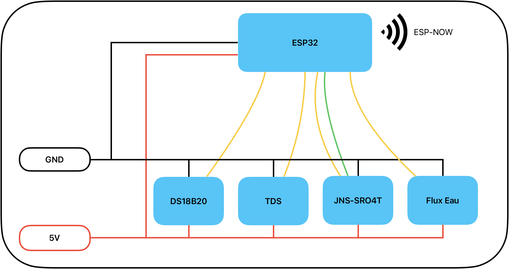

# HydroponX
Ce projet décrit un ensemble de module gérés par des microcontroleur ESP32 permettant de controler automatiquement un système de culture hydroponique.
Tous ces modules communiquent entre eux par le protocole ESP-NOW.

Le premier module recolte les mesures de différents capteurs:
- La temperature de l'eau par un capteur DS18B20
- l'EC de l'eau par un capteur TDS de CQRobot
- La quantité d'eau restant dans le réservoir d'eau par un capteur JNS-SR04T
- La présence d'eau revenant dans le réservoir par un capteur de niveau d'eau de CQRobot

Le second module:
- pilote la pompe à eau du système par un module relais
- collecte les mesures des capteurs et les envoient sur un broker MQTT en passant par une connection Wifi

## Architecture

## Module Capteur : cablage
| Capteur             | Broche ESP32 | Remarques                          |
|---------------------|--------------|------------------------------------|
| DS18B20 Data        | GPIO 4       | Résistance pull-up 4.7 kΩ vers 5V. |
| DS18B20 VCC         | 5V           |                                    |
| DS18B20 GND         | GND          |                                    |
| Sonde TDS (signal)  | GPIO 34      |                                    |
| Sonde TDS VCC       | 5V           |                                    |
| Sonde TDS GND       | GND          |                                    |
| JNS-SR04T Trig      | GPIO 12      |                                    |
| JNS-SR04T Echo      | GPIO 14      | Diviseur 5V→3.3V                   |
| JNS-SR04T VCC       | 5V           |                                    |
| JNS-SR04T GND       | GND          |                                    |
| Niveau eau (signal) | GPIO 27      | Pull-up interne activé             |
| Niveau eau VCC      | 5V           |                                    |
| Niveau eau GND      | GND          |                                    |



## Module gateway MQTT : cablage
| Composant            | Broche ESP32 | Remarques                          |
|----------------------|--------------|------------------------------------|
| Relais pompe IN      | GPIO 26      | HIGH = pompe ON                    |
| Relais pompe VCC     | 5V           |                                    |
| Relais pompe GND      | GND          |                                      |

## Topics MQTT

### Publiés par Module Gateway
| Topic                 | Valeur exemple | Description              |
|-----------------------|----------------|--------------------------|
| `hydro1/temperature`  | `22.50`        | Température eau (°C)     |
| `hydro1/ec`           | `1.850`        | Conductivité (mS/cm)     |
| `hydro1/water_level`  | `75`           | Niveau eau (%)           |
| `hydro1/flow_present` | `true`         | Flux présent (bool)      |
| `hydro1/pump_state`   | `ON`           | État relais pompe (bool) |
| `hydro/alerts`        | `ALERTE: …`    | Alertes système (string  |

### Souscrit par Module Gateway
| Topic                 | Valeurs acceptées | Description                  |
|-----------------------|-------------------|------------------------------|
| `hydro1/command`      | `JSON`            | Contrôle pompe, commande...  |

## Obtenir les adresses MAC
Flashez ce sketch minimal sur chaque ESP32 pour afficher son adresse MAC :

```cpp
#include <WiFi.h>
void setup() {
  Serial.begin(115200);
  WiFi.mode(WIFI_STA);
  Serial.println(WiFi.macAddress());
}
void loop() {}
```

---

## Étalonnage du capteur EC

Le capteur EC doit être étalonné avec des solutions étalon (ex. 1.413 mS/cm).
Mesurez la tension en sortie du capteur dans la solution étalon et ajustez
`EC_CALIBRATION_K` pour que la valeur calculée corresponde.

---

## Notes sur ESP-NOW + WiFi simultanés

Les deux protocoles utilisent la même radio WiFi. Pour qu'ils coexistent :
- Module 1 : `WiFi.mode(WIFI_STA)` + `WiFi.disconnect()` (pas de connexion AP)
- Module 2 : `WiFi.mode(WIFI_STA)` + connexion AP normale

Les deux modules doivent être sur le **même canal WiFi** (par défaut canal 1).
Si votre routeur utilise un canal différent, ajustez `peerInfo.channel` dans Module 1
ou forcez le canal dans `esp_now_add_peer`.
